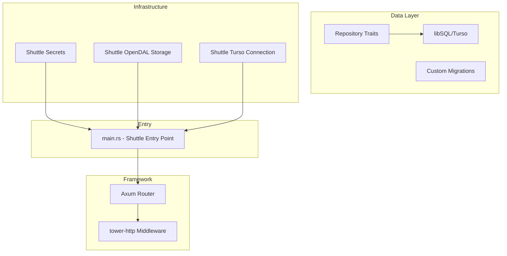
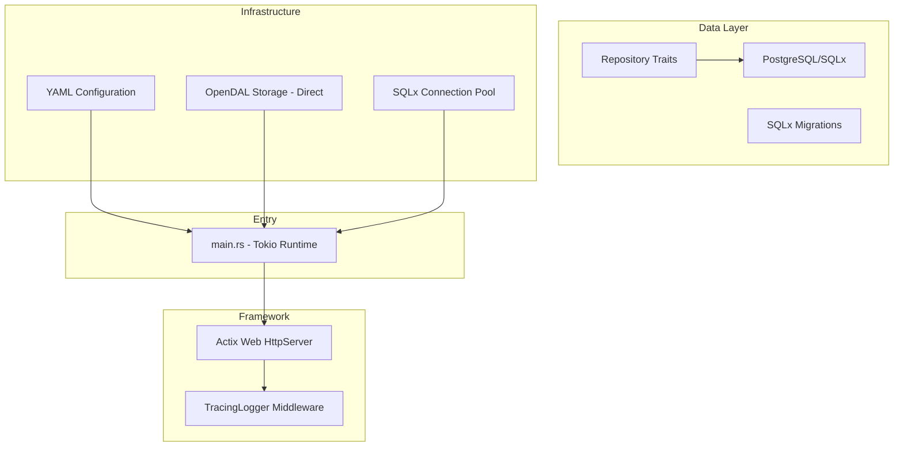

# Migration Plan: From Shuttle/Axum to Actix Web with SQLx

## Executive Summary

This document outlines the migration plan for transitioning the CrustyRustacean Dev Blog from:
- **Current Stack**: Axum + Turso/libSQL + Shuttle deployment
- **Target Stack**: Actix Web + PostgreSQL/SQLx + Self-hosted deployment

The migration follows the architecture pattern established in the `actix-web-sqlx-starter` repository.

## Architecture Comparison

### Current Architecture (Shuttle/Axum)



### Target Architecture (Actix Web/SQLx)



## Key Differences

| Aspect | Current (Shuttle/Axum) | Target (Actix/SQLx) |
|--------|------------------------|---------------------|
| Web Framework | Axum 0.8.7 | Actix Web 4.13 |
| Database | Turso/libSQL | PostgreSQL/SQLx |
| Configuration | Shuttle Secrets | YAML files + env vars |
| Deployment | Shuttle platform | Self-hosted (Docker/bare metal) |
| Middleware | tower-http | Actix middleware |
| Routing | Axum Router | Actix web::App |
| Extractors | FromRequestParts | actix_web::web extractors |
| Response | IntoResponse | Responder trait |
| Migrations | Custom versioned SQL | SQLx migrate! macro |

---

## Phase 1: Project Setup and Configuration Migration

### 1.1 Update Cargo.toml

**Remove Shuttle dependencies:**
```toml
# REMOVE
shuttle-axum = "0.57.0"
shuttle-opendal = "0.57.0"
shuttle-runtime = "0.57.0"
shuttle-turso = "0.57.0"
shuttle-common = "0.57.0"
```

**Add Actix Web and SQLx dependencies:**
```toml
# ADD
actix-web = "4.13.0"
actix-rt = "1"
sqlx = { version = "0.8", default-features = false, features = [
    "runtime-tokio-rustls",
    "macros",
    "postgres",
    "uuid",
    "chrono",
    "migrate",
] }
config = { version = "0.15", default-features = false, features = ["yaml"] }
secrecy = { version = "0.10", features = ["serde"] }
serde-aux = "4.7"
tracing-actix-web = "0.7"
```

**Update existing dependencies:**
```toml
# Update tokio features for standalone runtime
tokio = { version = "1", features = ["macros", "rt-multi-thread"] }
```

### 1.2 Create Configuration Directory Structure

```
configuration/
├── base.yaml          # Base configuration
├── local.yaml         # Local development overrides
└── production.yaml    # Production overrides
```

**base.yaml:**
```yaml
application:
  port: 8000
  host: 0.0.0.0
  base_url: "http://localhost:8000"

database:
  host: "127.0.0.1"
  port: 5432
  username: "postgres"
  password: "password"
  database_name: "crustyrustacean_blog"
  require_ssl: false

jwt:
  secret: "change-me-in-production"
  expiration_hours: 24

email:
  smtp_host: "smtp.example.com"
  smtp_port: 587
  smtp_username: ""
  smtp_password: ""
  from_address: "noreply@example.com"

storage:
  backend: "fs"  # or "s3"
  fs_root: "./uploads"
  s3_bucket: ""
  s3_region: ""
```

### 1.3 Create New Configuration Module

**src/lib/configuration.rs:**
- Define `Settings` struct with all application configuration
- Implement `get_configuration()` to load from YAML files
- Support environment variable overrides with `APP_` prefix
- Handle environment detection (local/production)

### 1.4 Update Main Entry Point

**src/bin/main.rs:**
```rust
use crustyrustacean_dev_blog_lib::configuration::get_configuration;
use crustyrustacean_dev_blog_lib::startup::Application;
use crustyrustacean_dev_blog_lib::telemetry::{get_subscriber, init_subscriber};

#[tokio::main]
async fn main() -> anyhow::Result<()> {
    let subscriber = get_subscriber(
        "crustyrustacean-dev-blog".into(),
        "info".into(),
        std::io::stdout,
    );
    init_subscriber(subscriber);
    
    let configuration = get_configuration()
        .expect("Failed to read configuration.");
    
    let application = Application::build(configuration).await?;
    application.run_until_stopped().await?;
    
    Ok(())
}
```

---

## Phase 2: Database Layer Migration

### 2.1 Migration Strategy: libSQL → PostgreSQL

**Key SQL Differences:**

| Feature | libSQL/SQLite | PostgreSQL |
|---------|---------------|------------|
| Auto-increment | `INTEGER PRIMARY KEY AUTOINCREMENT` | `SERIAL` or `GENERATED ALWAYS AS IDENTITY` |
| Boolean | `INTEGER (0/1)` | `BOOLEAN` |
| UUID | `TEXT` | `UUID` |
| Timestamps | `TEXT` (ISO 8601) | `TIMESTAMPTZ` |
| JSON | `TEXT` | `JSONB` |

### 2.2 Create SQLx Migrations

Convert existing migrations from `src/lib/migrations/sql/` to SQLx format:

**migrations/20260310000000_create_users.sql:**
```sql
CREATE TABLE users (
    id UUID PRIMARY KEY DEFAULT gen_random_uuid(),
    username VARCHAR(50) UNIQUE NOT NULL,
    email VARCHAR(255) UNIQUE NOT NULL,
    password_hash VARCHAR(255) NOT NULL,
    bio TEXT,
    image TEXT,
    disabled BOOLEAN NOT NULL DEFAULT FALSE,
    role VARCHAR(20) NOT NULL DEFAULT 'subscriber',
    email_verified BOOLEAN NOT NULL DEFAULT FALSE,
    theme_preference VARCHAR(50),
    created_at TIMESTAMPTZ NOT NULL DEFAULT NOW(),
    updated_at TIMESTAMPTZ NOT NULL DEFAULT NOW()
);

CREATE INDEX idx_users_email ON users(email);
CREATE INDEX idx_users_username ON users(username);
```

**migrations/20260310000001_create_articles.sql:**
```sql
CREATE TABLE articles (
    id UUID PRIMARY KEY DEFAULT gen_random_uuid(),
    slug VARCHAR(255) UNIQUE NOT NULL,
    title VARCHAR(255) NOT NULL,
    description TEXT NOT NULL,
    body TEXT NOT NULL,
    author_id UUID NOT NULL REFERENCES users(id) ON DELETE CASCADE,
    category_id UUID REFERENCES categories(id) ON DELETE SET NULL,
    draft BOOLEAN NOT NULL DEFAULT FALSE,
    featured_image_id VARCHAR(255),
    created_at TIMESTAMPTZ NOT NULL DEFAULT NOW(),
    updated_at TIMESTAMPTZ NOT NULL DEFAULT NOW()
);

CREATE INDEX idx_articles_slug ON articles(slug);
CREATE INDEX idx_articles_author_id ON articles(author_id);
CREATE INDEX idx_articles_draft ON articles(draft);
```

### 2.3 Update Database Connection Module

**src/lib/database.rs:**
- Replace `libsql::Database` with `sqlx::PgPool`
- Remove custom migration runner (use SQLx migrate!)
- Add connection pool configuration

```rust
use sqlx::postgres::PgPoolOptions;
use sqlx::PgPool;

pub fn get_connection_pool(configuration: &DatabaseSettings) -> PgPool {
    PgPoolOptions::new()
        .max_connections(5)
        .connect_lazy_with(configuration.connect_options())
}
```

### 2.4 Update Repository Implementations

For each repository (`*_libsql.rs`), create new PostgreSQL implementations:

**Example: src/lib/repositories/user_pg.rs:**
```rust
use sqlx::PgPool;
use async_trait::async_trait;

pub struct PgUserRepository {
    pool: PgPool,
}

impl PgUserRepository {
    pub fn new(pool: PgPool) -> Self {
        Self { pool }
    }
}

#[async_trait]
impl UserRepository for PgUserRepository {
    async fn find_by_email(&self, email: &str) -> RepoResult<Option<User>> {
        let user = sqlx::query_as!(
            User,
            r#"SELECT id, username, email, password_hash, bio, image, 
                      disabled, role as "role: Role", email_verified, 
                      theme_preference, created_at, updated_at
               FROM users WHERE email = $1"#,
            email
        )
        .fetch_optional(&self.pool)
        .await
        .map_err(|e| RepositoryError::Database(e.to_string()))?;
        
        Ok(user)
    }
    // ... other methods
}
```

---

## Phase 3: Web Framework Migration

### 3.1 Routing Differences

| Axum | Actix Web |
|------|-----------|
| `Router::new().route("/path", get(handler))` | `App::new().route("/path", web::get().to(handler))` |
| `Path<Param>` extractor | `web::Path<Param>` |
| `Query<T>` extractor | `web::Query<T>` |
| `Json<T>` extractor | `web::Json<T>` |
| `State<S>` extractor | `web::Data<S>` |
| `Multipart` extractor | `actix-multipart::Multipart` |

### 3.2 Create Startup Module

**src/lib/startup.rs:**
```rust
use actix_web::{App, HttpServer, web, dev::Server};
use actix_web::middleware::Logger;
use tracing_actix_web::TracingLogger;
use sqlx::PgPool;
use std::net::TcpListener;

pub struct Application {
    port: u16,
    server: Server,
}

impl Application {
    pub async fn build(configuration: Settings) -> Result<Self, anyhow::Error> {
        let connection_pool = get_connection_pool(&configuration.database);
        
        // Run migrations
        sqlx::migrate!("./migrations")
            .run(&connection_pool)
            .await?;
        
        let address = format!(
            "{}:{}",
            configuration.application.host,
            configuration.application.port
        );
        let listener = TcpListener::bind(address)?;
        let port = listener.local_addr()?.port();
        
        let server = run(
            listener,
            connection_pool,
            configuration.application.base_url,
            configuration,
        )?;
        
        Ok(Self { port, server })
    }
    
    pub fn port(&self) -> u16 {
        self.port
    }
    
    pub async fn run_until_stopped(self) -> Result<(), std::io::Error> {
        self.server.await
    }
}

pub async fn run(
    listener: TcpListener,
    db_pool: PgPool,
    base_url: String,
    config: Settings,
) -> Result<Server, anyhow::Error> {
    let db_pool = web::Data::new(db_pool);
    let base_url = web::Data::new(ApplicationBaseUrl(base_url));
    // ... additional app data
    
    let server = HttpServer::new(move || {
        App::new()
            .wrap(TracingLogger::default())
            // Static files
            .service(actix_files::Files::new("/static", "./static").use_last_modified(true))
            // Routes
            .configure(configure_routes)
            // App data
            .app_data(db_pool.clone())
            .app_data(base_url.clone())
    })
    .listen(listener)?
    .run();
    
    Ok(server)
}

fn configure_routes(cfg: &mut web::ServiceConfig) {
    cfg
        // Health check
        .route("/health_check", web::get().to(health_check))
        // API routes
        .service(
            web::scope("/api")
                .route("/users", web::post().to(register_user))
                .route("/users/login", web::post().to(login_user))
                // ... more API routes
        )
        // HTML pages
        .route("/", web::get().to(get_index))
        .route("/articles", web::get().to(get_articles_list_page))
        // ... more HTML routes
        ;
}
```

### 3.3 Handler Signature Changes

**Axum handler:**
```rust
pub async fn get_article(
    State(state): State<AppState>,
    Path(slug): Path<String>,
    user: OptionalUser,
) -> Result<Json<SingleArticleResponse>, ApiError> {
    // ...
}
```

**Actix Web handler:**
```rust
pub async fn get_article(
    path: web::Path<String>,
    state: web::Data<AppState>,
    user: OptionalUser,  // Custom extractor
) -> Result<HttpResponse, ApiError> {
    let slug = path.into_inner();
    // ...
}
```

### 3.4 Response Handling

**Axum:**
```rust
impl IntoResponse for ApiError {
    fn into_response(self) -> Response {
        // ...
    }
}
```

**Actix Web:**
```rust
impl ResponseError for ApiError {
    fn status_code(&self) -> StatusCode {
        // ...
    }
    
    fn error_response(&self) -> HttpResponse<BoxBody> {
        // ...
    }
}
```

---

## Phase 4: Authentication System Migration

### 4.1 Extractor Pattern

**Axum:**
```rust
impl FromRequestParts<AppState> for AuthenticatedUser {
    type Rejection = ApiError;
    
    async fn from_request_parts(
        parts: &mut Parts,
        state: &AppState,
    ) -> Result<Self, Self::Rejection> {
        // ...
    }
}
```

**Actix Web:**
```rust
impl FromRequest for AuthenticatedUser {
    type Error = ApiError;
    type Future = Pin<Box<dyn Future<Output = Result<Self, Self::Error>>>>;

    fn from_request(req: &HttpRequest, payload: &mut Payload) -> Self::Future {
        // Extract Authorization header or cookie
        // Validate JWT
        // Return user or error
    }
}
```

### 4.2 JWT Implementation

The JWT logic can remain largely the same, but needs adaptation for Actix:
- Keep `Keys` struct for encoding/decoding
- Keep `Claims` struct
- Update error handling to use Actix's `ResponseError`

### 4.3 Password Hashing

No changes needed - Argon2 implementation is framework-agnostic.

---

## Phase 5: Repository Pattern Adaptation

### 5.1 Repository Trait Updates

The repository traits can remain largely unchanged. Only the implementations need updating:

**Before (libSQL):**
```rust
pub struct LibSqlUserRepository {
    db: DatabaseConnection,
}
```

**After (PostgreSQL):**
```rust
pub struct PgUserRepository {
    pool: PgPool,
}
```

### 5.2 SQL Query Updates

Convert all queries from libSQL syntax to PostgreSQL:

| libSQL | PostgreSQL |
|--------|------------|
| `?1`, `?2` parameters | `$1`, `$2` parameters |
| `RETURNING *` | Same, but with proper type mapping |
| `last_insert_rowid()` | `RETURNING id` |

### 5.3 Type Mappings

Use SQLx's `query_as!` macro for compile-time checked queries:
```rust
sqlx::query_as!(
    User,
    r#"SELECT ... FROM users WHERE id = $1"#,
    user_id
)
```

---

## Phase 6: Route Handlers Migration

### 6.1 Handler Migration Checklist

For each route handler file in `src/lib/routes/`:

1. Update imports from Axum to Actix Web
2. Change extractor types
3. Update response types
4. Adapt error handling

### 6.2 Files to Migrate

| File | Key Changes |
|------|-------------|
| `health_check.rs` | Simple - just change return type |
| `auth.rs` | Update session/cookie handling |
| `users.rs` | Update JSON extractors |
| `articles.rs` | Update multipart handling |
| `profile.rs` | Update path extractors |
| `media.rs` | Update multipart file handling |
| `newsletters.rs` | Update JSON and query extractors |
| `rss.rs` | Update XML response handling |
| `search.rs` | Update query parameter handling |

### 6.3 Static File Serving

**Axum (tower-http):**
```rust
.nest_service("/static", ServeDir::new("static"))
```

**Actix Web:**
```rust
.service(actix_files::Files::new("/static", "./static").use_last_modified(true))
```

---

## Phase 7: Template and Static File Handling

### 7.1 Tera Templates

Tera is framework-agnostic and can remain unchanged. The template rendering needs minor adaptation:

**Axum:**
```rust
let html = state.templates.render("index.html", &context)?;
Ok(Html(html))
```

**Actix Web:**
```rust
let html = state.templates.render("index.html", &context)?;
Ok(HttpResponse::Ok()
    .content_type("text/html")
    .body(html))
```

### 7.2 Template Functions

Custom Tera functions remain unchanged - they don't depend on the web framework.

---

## Phase 8: Storage and Email Service Configuration

### 8.1 OpenDAL Storage

Remove Shuttle OpenDAL integration and configure directly:

```rust
use opendal::Operator;
use opendal::services::Fs;  // or S3

pub fn configure_storage(config: &StorageSettings) -> Result<Operator, anyhow::Error> {
    match config.backend.as_str() {
        "fs" => {
            let builder = Fs::default().root(&config.fs_root);
            Ok(Operator::new(builder)?.finish())
        }
        "s3" => {
            // S3 configuration
        }
        _ => Err(anyhow::anyhow!("Unknown storage backend"))
    }
}
```

### 8.2 Email Service

The email service is already framework-agnostic. Update configuration loading from YAML instead of Shuttle secrets.

---

## Phase 9: Test Infrastructure Migration

### 9.1 Test Helper Updates

**Current (Axum):**
```rust
let app = spawn_app().await;
let response = app
    .client
    .post(format!("{}/api/users", &app.address))
    .json(&data)
    .send()
    .await;
```

**Target (Actix):**
```rust
let app = spawn_app().await;
let response = app
    .api_client
    .post(&format!("{}/api/users", &app.address))
    .json(&data)
    .send()
    .await;
```

### 9.2 Test Database Setup

Update test database configuration:
- Use PostgreSQL test database
- Use SQLx migrations
- Use `LazyLock` for tracing initialization

### 9.3 Test Files to Update

All test files in `tests/api/` need minor updates:
- Import paths remain similar
- HTTP client usage is the same (reqwest)
- Database cleanup may need adjustment for PostgreSQL

---

## Phase 10: Documentation and Cleanup

### 10.1 Files to Remove

- `Shuttle.toml`
- `cargo-generate.toml`
- `src/lib/migrations/` (replaced by `migrations/`)

### 10.2 Files to Update

- `README.md` - Update deployment instructions
- `CHANGELOG.md` - Document migration
- `.env.example` - Add environment variable documentation

### 10.3 New Files to Create

- `Dockerfile` - For containerized deployment
- `docker-compose.yml` - For local development with PostgreSQL
- `.env.example` - Environment variable template

---

## Migration Order

The recommended migration order:

1. **Phase 1**: Project setup (Cargo.toml, configuration)
2. **Phase 2**: Database layer (migrations, repositories)
3. **Phase 3**: Web framework (startup, routing)
4. **Phase 4**: Authentication (extractors, JWT)
5. **Phase 5**: Repository implementations
6. **Phase 6**: Route handlers (one by one)
7. **Phase 7**: Templates (minimal changes)
8. **Phase 8**: Storage and email
9. **Phase 9**: Tests
10. **Phase 10**: Documentation

---

## Risk Assessment

| Risk | Mitigation |
|------|------------|
| SQL syntax differences | Thorough testing of all queries |
| Type mapping issues | Use SQLx compile-time checks |
| Authentication flow breakage | Comprehensive auth tests |
| Performance regression | Benchmark before/after |
| Missing features | Document any removed functionality |

---

## Estimated Effort

This is a significant migration affecting:
- ~50+ source files
- 14 SQL migrations
- 323+ tests
- All route handlers
- All repository implementations

The migration should be done incrementally with thorough testing at each phase.
